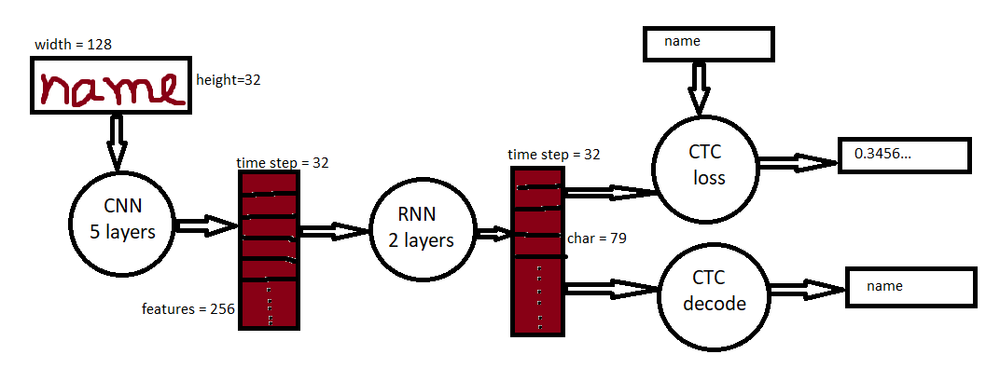
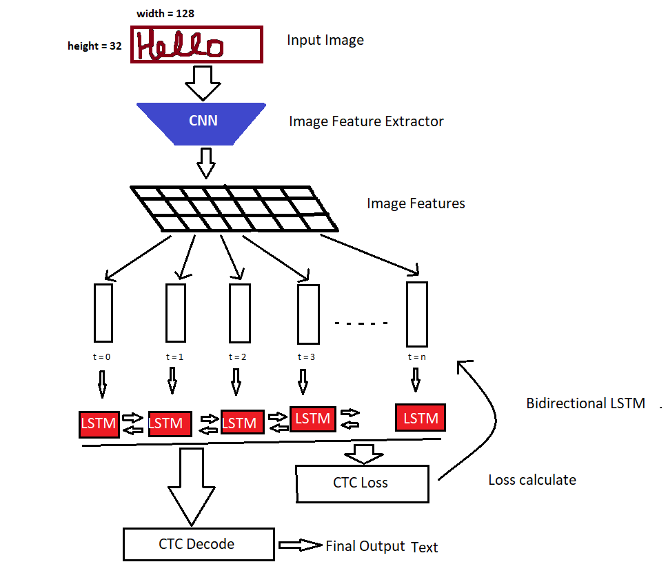

# Handwritten-text-extraction

The handwritten text recognition system extract the whole handwritten text from an image.First it scan the whole image and then convert the handwritten text into digital text. The whole process is done with the help of neural network model. The implementation of neural network model is done in tensorflow and keras. First we collect the data from IAM database and preprocess the image of text and train the model with the help of CTC loss function and RMSprop optimizer. After completion of training, we convert the handwritten text into digital text or predict the text.

# Model

In this project we use neural network. In this first convolutional neural network then recurrent neural network and in final layer connectionist temporal classification (CTC) layer.

# Tools used

There are many types of tools(libraries) have been used such as-
<ul>
<li>tensorflow-2.0.0</li>
<li>keras-2.2.4</li>
<li>cv2-4.1.2</li>
<li>numpy- 1.16.5</li>
<li>glob and os </li>
</ul>

# Dataset Collaction

One of the most popular dataset is IAM datadase in which the words are written by more than 600 writers. From this database I have only download word data.

# Project Diagram

